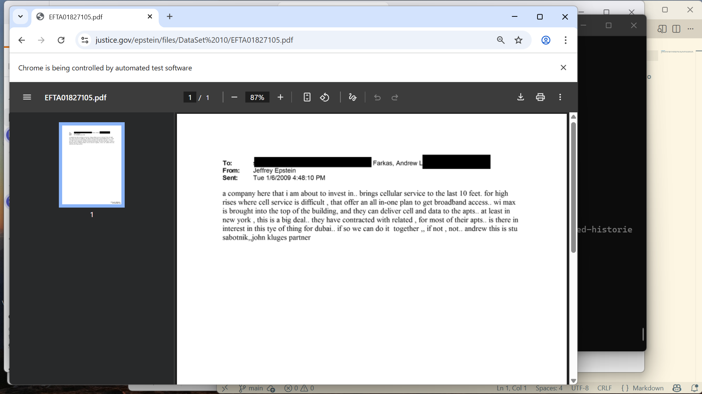

# Epscraper

Automated trawling through the government Epstein files. Uses python and selenium. Feed it a url and it will open it in the browser, then increment the url and open that and so on.

I made this because I was clicking through the urls and got fed up. This makes it easier to search through files as you can simply watch and look out any pdfs of interest.

###### Step 1
